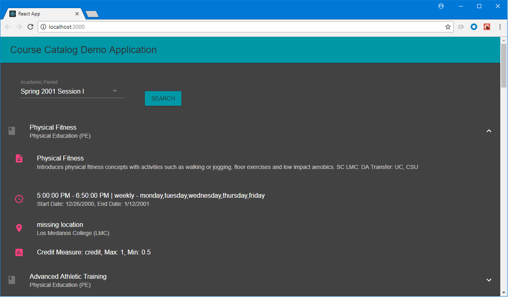

# Course Catalog Demo

This demo web application uses Ethos Integration to build a course catalog.



## Installing / Getting started

This project uses node and npm.  To get started clone the repository and run the following commands.

*Note - a valid Ethos Integration api key needs to be added to src/index.js for the app to work.*

```shell
npm install

npm run start
```
A new browser window should pop up with the app.  If it does not, simply create a new browser window and navigate to http://localhost:3000.

## Description

The course catalog demo is a simple React web app that makes api calls to Ethos Integration. The user is allowed to select from a list of academic periods and click the search button. The app will then make several api calls to build up a descriptive display of all the course sections that are available in that academic period.

## Notes about the code

A basic knowledge of React and/or web apps will be helpful understanding the code. The app is built from the Create React App tool (https://github.com/facebook/create-react-app) and uses Material UI component library (https://www.material-ui.com).

The design of the app does not reflect what a production application should look like. It is not a reference implementation. It is meant to illustrate how api calls can be made to Ethos Integration and do something useful.
